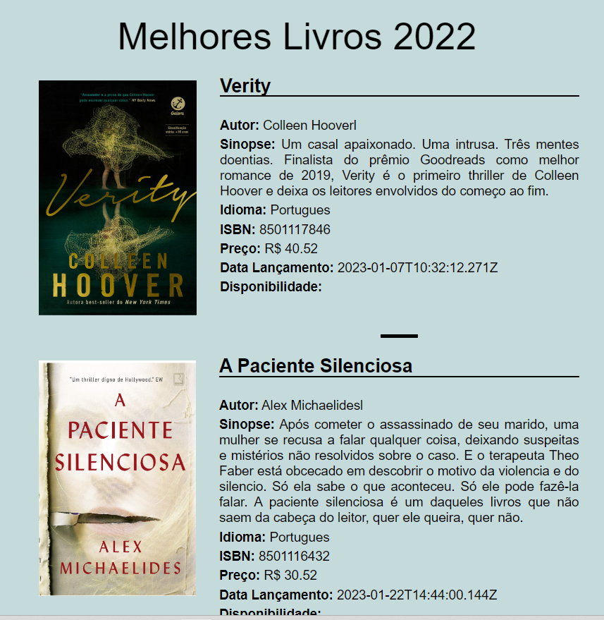

🚀✨ Proposta do projeto.

Consumir os dados do projeto anterio que consistiu em uma API fazendo CRUD na tabela books dos melhores livros lidos em 2022 e apresentá-los em uma pagina de internet de modo dinamico onde qualquer inclusão, alteração ou exclusão dos dados no banco fefletissem automaticamente na página.

🧠✨ O que aprendi.

Conceitos de comunicação com uma api por meio de dados no formato JSON. Utilização dos conceitos de Javascript para atualização das páginas dinamicamente sendo injetadas na página web, utilização de HTML e CSS. Criação de Classes e manipulação de Objestos em Javascript.

🔧✨ Tecnologias utilizadas.

JavaScript, HTML, CSS e NodeJs.

💻✨ Rodando o projeto.

Para este projeto funcionar é necessário que a API do projeto anterior esteja iniciada para receber o pelo método GET a busca na tabela books todos os livros que estão cadastrados.
 
Segue Segue abaixo uma imagem para elucidar o resultado final, onde os campos nome, autor, sinopse e demais estão sendo coletados pela API e sendo gerados dinamicamente.

